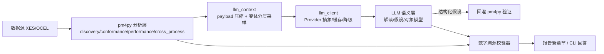

## 用户需求

把上一轮回答中【七、建议的落地路线】转成可执行计划。用户明确约束：**不要把 bpm-agent 卷进来，只在 datamind 工作空间内实施 pm4py 与 LLM 的组合方案**。

## 产品概述

在 datamind 现有 pm4py 分析能力之上新增一层 LLM 能力，形成「pm4py 出数字、LLM 出语义」的组合分析。核心铁律：**LLM 只做语义理解与假设提出，pm4py 只做计算与判定，结论中的每个数字必须来自 pm4py 的结构化输出**。

## 核心功能

1. **L0 结果解读**：把流程发现 / 合规 / 性能 / 跨流程触发的结构化指标压缩成精简 payload，交给 LLM 生成业务语言解读，并注入现有 HTML 报告新增章节。
2. **L3 假设验证闭环**：LLM 提出候选异常假设，转成白名单过滤器，由 pm4py 计算 lift + 卡方 + BH FDR 校正后判定成立与否。
3. **L1 对象模型抽取**：从 BPMN XML 与活动名清单产出对象类型 / o2o / 展开规则候选，回灌转换器验证达标后供人工审核。
4. **L4 交互问答闭环**：CLI 形式的多轮问答，自动选择分析路径、缓存结果、回答带证据锚点。
5. **可靠性底座**：数字溯源校验器（LLM 输出中出现 payload 之外的数字即拒绝）、离线降级、结果缓存、无 API key 可跑全流程。

## 技术栈

- 语言/运行时：Python 3.14，虚拟环境 `datamind/datamind/.venv`（必须用 `.venv/bin/python`，系统 Python 无 pm4py）
- 现有：pm4py 2.7.23.8、pandas、numpy、pyyaml、graphviz
- 新增（**可选依赖组**，不进核心依赖）：`openai>=1.50`（OpenAI 兼容协议，支持 `base_url` 指向自建/国内模型、`response_format=json_schema` 结构化输出、内置超时与重试）
- 参数校验：pydantic v2（openai SDK 已带入）
- 测试：pytest（现有 `testpaths=["tests"]`、`pythonpath=["."]`，**未设 asyncio_mode**，故 LLM 客户端统一用**同步**客户端，不引入 pytest-asyncio）

## 实现方案

### 总体策略

在 `src/` 下新增一层与现有分析模块平级的 LLM 模块，通过「结构化契约」与 pm4py 交接：



关键设计决策与取舍：

| 决策 | 选择 | 理由 |
| --- | --- | --- |
| LLM 依赖 | 放 `[project.optional-dependencies] llm`，核心依赖不动 | CI 与离线环境不装也能跑通全部测试，不破坏现有 28 个测试 |
| 客户端形态 | 同步 `openai.OpenAI` | 项目 pytest 未开 asyncio_mode，同步可避免引入 pytest-asyncio |
| Provider 抽象 | `OpenAIProvider` / `ScriptedProvider`（手写 fake）/ `NullProvider` | 沿用「手写 fake 不用 mock 库」的思路，测试完全离线可复现 |
| 输出校验 | pydantic schema + JSON mode + **数字溯源校验器** | 三重防幻觉：schema 拦格式、JSON mode 降随机、溯源器拦编造数字 |
| 降温策略 | `temperature=0` + 结果缓存（payload hash → `.cache/llm/*.json`） | 保证同输入同输出，成本与延迟可控 |
| 假设执行 | 白名单过滤器（活动集合 / 对象类型 / 时间区间 / case 属性），**不做任意代码执行** | 安全边界，LLM 只能选参数不能写代码 |


### 性能考量

- 真正的耗时大头是 pm4py 本身（81MB 的 `p2p.jsonocel` 加载 + `discover_ocdfg`/`discover_oc_petri_net`），LLM 只处理压缩后的聚合结果，单次 payload 控制在数 KB 级。
- 分析结果与 LLM 结果**分别缓存**：分析缓存 key = `(dataset, 算法参数)`；LLM 缓存 key = `(prompt 模板版本, payload hash, model)`，模板版本进 key 防止改 prompt 后误用旧缓存。
- 变体采样按**分层**而非截断：高频变体各取 1 条代表迹，低频异常变体优先保留，避免「只看到一种流程形态」。

## 实现要点（执行细节）

- **向后兼容优先**：`build_report` / `build_ocel_report` 只新增 `llm_insight: dict | None = None` 可选参数；为 `None` 时不渲染新章节，现有报告与 28 个测试不受影响。
- **默认关闭**：`config.yaml` 中 `llm.enabled: false`，未配置时走 `NullProvider` 降级为规则化摘要，保证 `src.main` / `src.ocel_main` 原有行为不变。
- **密钥安全**：API key 只读环境变量（如 `DATAMIND_LLM_API_KEY`），不写入 `config.yaml`、不进缓存文件、不进审计日志。
- **审计**：每次 LLM 调用写 `outputs/llm_audit.jsonl`，记录模板版本、payload hash、耗时、token、是否命中缓存，**不记录原文**。
- **依赖方向**：LLM 模块只依赖分析结果与配置，不被现有分析模块反向 import，保持 `分析层 → LLM 层` 单向。
- 命令基线：`.venv/bin/python -m pytest -q` 必须保持全绿；真实 LLM 调用仅出现在标记 `@pytest.mark.e2e` 的用例中。

## 架构设计

四阶段可独立验收，前一阶段产物是后一阶段的输入：

- **阶段一 底座**：`llm_client`（调用/缓存/降级）+ `llm_context`（payload 压缩 + 数字溯源校验器）
- **阶段二 L0**：`insight` 解读 → 注入报告新章节 → CLI 输出
- **阶段三 L3**：`hypothesis` 提假设 → 白名单过滤 → pm4py 统计判定 → 结论
- **阶段四 L1 + L4**：`object_model_draft` 对象模型抽取与回灌校验；`llm_main` 交互问答闭环 + eval 回归

## 目录结构

```
datamind/datamind/
├── src/
│   ├── llm_client.py           # [NEW] LLM 调用层。定义 LLMProvider 抽象与三种实现
│   │                           #   (OpenAIProvider / ScriptedProvider / NullProvider)；
│   │                           #   负责 timeout、重试、temperature=0、JSON schema 校验、
│   │                           #   磁盘缓存、审计写盘。无 API key 时自动降级 NullProvider。
│   ├── llm_context.py          # [NEW] 交接层。把 discovery/conformance/performance/
│   │                           #   cross_process 的结果压缩成 MiningFacts payload：
│   │                           #   只保留聚合指标 + Top-N 变体(分层采样) + evidence 锚点。
│   │                           #   内含数字溯源校验器 assert_numbers_from_facts()。
│   ├── insight.py              # [NEW] L0 解读。facts → LLM → InsightResult
│   │                           #   (findings 含 claim/metric_refs/evidence，recommendations)。
│   │                           #   prompt 强制「只能用 FACTS 中的数字」，输出经溯源校验。
│   ├── hypothesis.py           # [NEW] L3 假设闭环。LLM 产出结构化假设 → 白名单过滤器
│   │                           #   (活动集合/对象类型/时间区间) → pm4py 计算 lift+卡方+FDR
│   │                           #   → HypothesisVerdict(supported/rejected/inconclusive)。
│   ├── object_model_draft.py   # [NEW] L1 对象模型抽取。读 BPMN XML + 活动名清单，
│   │                           #   LLM 产出 ObjectSpec/O2ORule/ExpansionRule 候选；
│   │                           #   回灌 bpmn_converter 验证(孤立事件率/平均对象事件)，
│   │                           #   输出 diff 报告，不自动改 registry。
│   ├── llm_main.py             # [NEW] L4 交互闭环 CLI。意图识别 → 选择分析路径 →
│   │                           #   执行 → 解读 → 带证据回答；含轮次上限与结果缓存。
│   ├── report_generator.py     # [MODIFY] 新增可选参数 llm_insight，追加「智能解读」章节
│   ├── ocel_report.py          # [MODIFY] 同上，OCEL 报告追加「异常假设验证」章节
│   ├── main.py                 # [MODIFY] 可选挂载 L0 解读(受 llm.enabled 控制)
│   └── ocel_main.py            # [MODIFY] 可选挂载 L0/L3
├── config.yaml                 # [MODIFY] 新增 llm 配置段(enabled/model/base_url/
│                               #   api_key_env/timeout_s/temperature/cache_dir/max_variants)
├── pyproject.toml              # [MODIFY] 新增 [project.optional-dependencies] llm = ["openai>=1.50"]
├── tests/
│   ├── test_llm_client.py      # [NEW] fake provider、缓存命中、schema 失败重试、无 key 降级
│   ├── test_llm_context.py     # [NEW] payload 压缩、分层采样、数字溯源校验
│   ├── test_insight.py         # [NEW] 输出含 payload 外数字 → 拒绝；evidence 必填
│   ├── test_hypothesis.py      # [NEW] 用 p2p_sim 已知事实断言(如 Return→Invoice 应成立)
│   └── test_object_model_draft.py # [NEW] 候选结构合法、回灌校验达标判定
├── eval/
│   └── llm_regression.yaml     # [NEW] 固定数据集+固定问题+期望断言，防结论漂移
└── README.md                   # [MODIFY] 新增「LLM × pm4py」章节与配置说明
```

## 关键代码结构

```python
# src/llm_client.py —— 调用层契约
class LLMProvider(Protocol):
    def complete(self, system: str, user: str, schema: type[BaseModel],
                 *, cache_key: str | None = None) -> BaseModel: ...
# 三种实现：OpenAIProvider(真实) / ScriptedProvider(离线 fake) / NullProvider(规则化降级)

# src/llm_context.py —— pm4py 与 LLM 的唯一交接契约
class MiningFacts(BaseModel):
    dataset: str
    scope: str                       # "single" | "ocel"
    metrics: dict[str, float | int]  # 全部由 pm4py 填充，LLM 不得新增
    top_variants: list[dict]         # 分层采样后的代表迹
    bottlenecks: list[dict]
    cross_triggers: list[dict]       # 含 lift / p_value / significant
    evidence: dict[str, str]         # 指标 → 报告章节锚点

def assert_numbers_from_facts(text: str, facts: MiningFacts) -> None:
    """数字溯源：文本中出现的任何数字都必须能在 facts 中找到，否则抛错。"""
```

```python
# src/hypothesis.py —— 假设与判定
class Hypothesis(BaseModel):
    name: str
    rationale: str
    filter: dict          # 白名单：{"activities": [...], "object_types": [...], "time_range": [...]}

class HypothesisVerdict(BaseModel):
    hypothesis: str
    supported: bool
    lift: float
    p_value: float
    fdr_significant: bool
    sample_size: int
    evidence: str
```